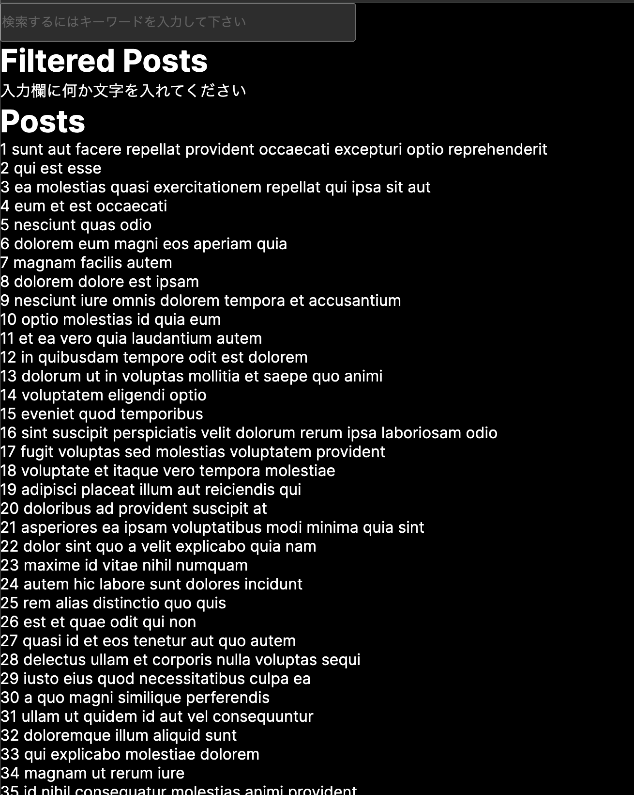
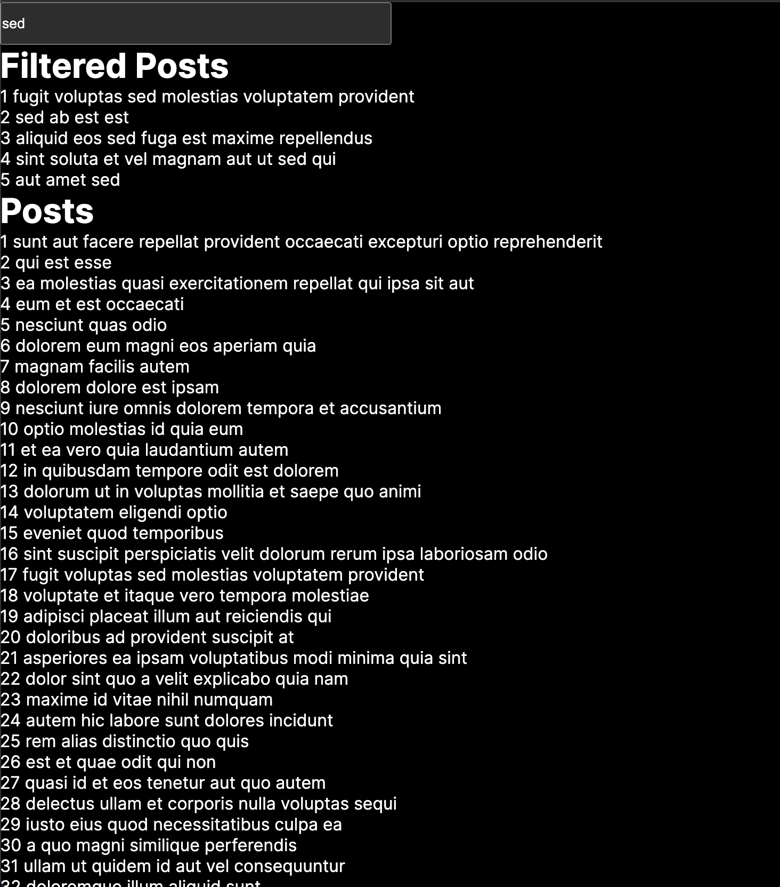

# Filtering-ServerComponent

Next.jsのサーバーコンポーネントを使用して、バックエンドからデータを取得し、それをフィルタリングする方法の自分用メモです。ちなみに、Next.jsはv14.1.4です。また、「use-debounce」というライブラリをインストールして使用していますが、UX的に望ましいから使用しているだけで別に必須というわけではないです。

以下が詳しいコードです。importしているSearchコンポーネントのソースコードも以下のコードのすぐ下に書いています。
```
import Search from "./component/Search";

const Page = async ({
  searchParams,
}: {
  searchParams: { [key: string]: string | string[] | undefined };
}) => {
  // searchParamsオブジェクトのtitleプロパティが文字列型のデータであれば、その文字列型のデータを格納
  const searchTitle =
    typeof searchParams.title === "string" ? searchParams.title : undefined;

  // Seachコンポーネントのfetchを使って、データを取得している
  const posts: POSTS = await getData({ query: searchTitle });

  // フィルタリングされたデータ
  const filterdPosts = posts.filter((post) => post.title.includes(searchTitle));

  return (
    <>
      <Search search={searchTitle} />
      <h1>Filtered Posts</h1>
      {/* フィルタリングされたデータを展開 */}
      {filterdPosts.length > 0 ? (
        <ul>
          {filterdPosts.map((filteredPost, index) => (
            <li key={filteredPost.id}>
              {index + 1} {filteredPost.title}
            </li>
          ))}
        </ul>
      ) : <p>入力欄に何か文字を入れてください</p>}

      <h1>Posts</h1>
      {/* フィルタリングされていないデータを展開 */}
      <ul>
        {posts.map((post, index) => (
          <li key={post.id}>
            {index} {post.title}
          </li>
        ))}
      </ul>
    </>
  );
};

export default Page;

async function getData({ query }: { query: string | undefined }) {
  let res;
  if (query) {
    res = await fetch(`https://jsonplaceholder.typicode.com/posts?${query}`);
  } else {
    res = await fetch(`https://jsonplaceholder.typicode.com/posts/`);
  }

  return res.json();
}

export type POSTS = {
  id: number;
  title: string;
}[];
```

以下が、Searchコンポーネントのソースコードです。
```
"use client";

import { useEffect, useRef, useState } from "react";
import { useRouter } from "next/navigation";
import { useDebounce } from "use-debounce";

const Search = ({ search }: { search?: string }) => {
  const router = useRouter();
  const initialRender = useRef(true);

  const [text, setText] = useState(search);

  // UXなどの観点から、入力欄に文字を入れてから500ms遅延した後にuseEffect内の処理が走るようにしています
  const [query] = useDebounce(text, 500);

  useEffect(() => {
    // 最初のレンダリング時には、何も起きないようにしている
    if (initialRender.current) {
      initialRender.current = false;
      return;
    }

    if (!query) {
      router.push(`/`);
    } else {
      router.push(`/?title=${query}`);
    }
  }, [query]);

  return (
    <div>
      <input
        type="text"
        value={text}
        placeholder="検索するにはキーワードを入力して下さい"
        onChange={(e) => setText(e.target.value)}
        style={{display: "inline-block",width: "50%", height: "50px"}}
      />
    </div>
  );
};

export default Search;
```

要するに、useRouterとバックエンドのサーバーのURLに適切なクエリパラメータを追加することで、サーバーコンポーネントをフィルタリングしています。

以下に実際の画面の画像を載せておきます。

まずはフィルタリングされる前の画像です。


そして次は入力欄でデータをフィルタリングした場合の画像です。入力欄には「sed」という文字列を入れたので、「sed」という文字が入っているデータのみ()


参考にしたサイトと動画

https://zenn.dev/inaniwaudon/articles/2d0222ac183b86

https://www.youtube.com/watch?v=e7bUYg7_hCI